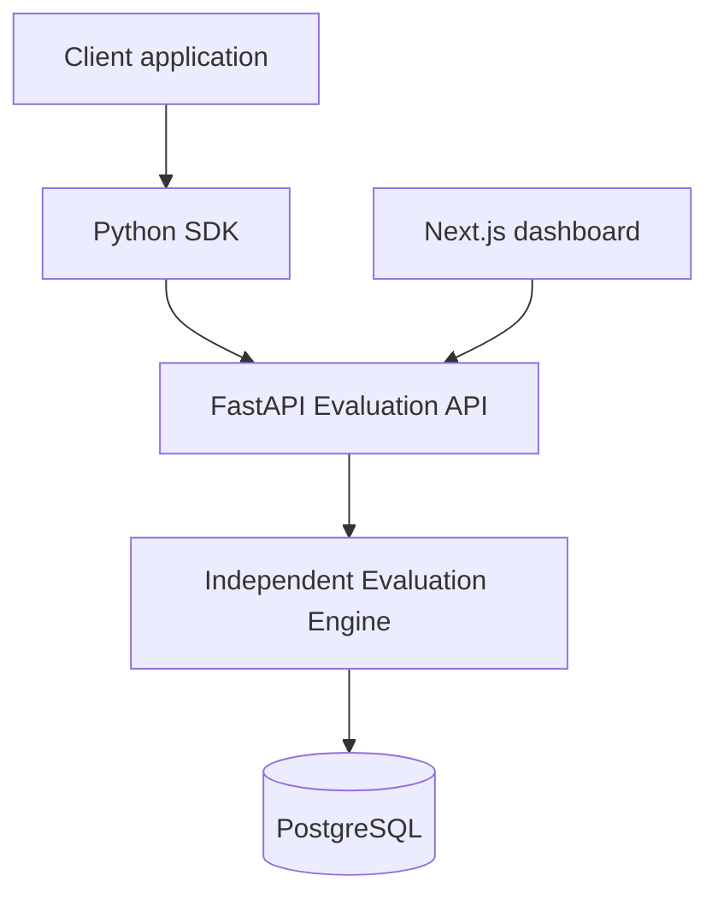

# Flagship — Feature Flag Management Platform

A production-minded, standalone feature-flag control plane for managing releases safely. Create projects and environments, protect dashboard actions with JWTs, issue environment API keys, and evaluate boolean flags via REST or the lightweight Python SDK.

## Architecture



The evaluation path is deliberately small: API-key authentication → lookup → deterministic rules and rollout → response.

## Features

- JWT registration/login and project ownership checks
- Projects, environments, boolean flags, audit records and safely hashed API keys
- `equals`/`not_equals` targeting against ID, email, country and plan
- Stable percentage rollout based on SHA-256 of flag key and user ID
- FastAPI OpenAPI documentation at `/docs`
- Typed Python SDK with timeout-safe fallback behavior
- Responsive dark developer-tool dashboard

## Stack

Next.js + TypeScript + Tailwind, FastAPI + Pydantic v2 + SQLAlchemy + Alembic, PostgreSQL, and `httpx` for the SDK.

## Project structure

```text
frontend/       Next.js dashboard
backend/        FastAPI app, evaluation engine, database and tests
sdk-python/     Installable Python client
```

## Local setup

Prerequisites: Python 3.12+, Node 20+, and a local PostgreSQL database named `featureflags`.

```bash
cp .env.example .env
cd backend
python -m venv .venv
.venv/Scripts/activate          # Windows
pip install -r requirements.txt
alembic revision --autogenerate -m "initial schema"
alembic upgrade head
python -m app.seed
uvicorn app.main:app --reload
```

For development only, omitting `DATABASE_URL` uses a local SQLite file; production must set a PostgreSQL `DATABASE_URL` and a strong `JWT_SECRET`.

In another terminal:

```bash
cd frontend
npm install
npm run dev
```

Set `NEXT_PUBLIC_API_URL=http://localhost:8000/api/v1` when your API runs elsewhere. Demo seed credentials are `demo@featureflags.local` / `demo-password`.

## API example

Create an environment key in the dashboard, then evaluate:

```bash
curl -X POST http://localhost:8000/api/v1/evaluate \
  -H "Content-Type: application/json" -H "X-API-Key: ff_production_xxx" \
  -d '{"environment_key":"production","flag_key":"new_checkout","user":{"id":"user_123","plan":"premium"}}'
```

The response includes `enabled` and one of `disabled`, `targeting_rule`, `percentage_rollout`, or `default`.

## Python SDK

```bash
cd sdk-python && pip install -e .
```

```python
from featureflag import FeatureFlagClient
client = FeatureFlagClient(api_key="ff_production_xxx")
if client.is_enabled("new_checkout", user={"id": "user_123", "plan": "premium"}):
    print("New checkout enabled")
```

## Testing

```bash
cd backend && pytest
cd ../sdk-python && pip install -e . && pytest
```

## Screenshots

_Add dashboard screenshots here after running the app locally._

## Future improvements

Flag variants, rule groups, bulk evaluations, environment cloning, rate limiting, SDK caching, and a CI pipeline.
